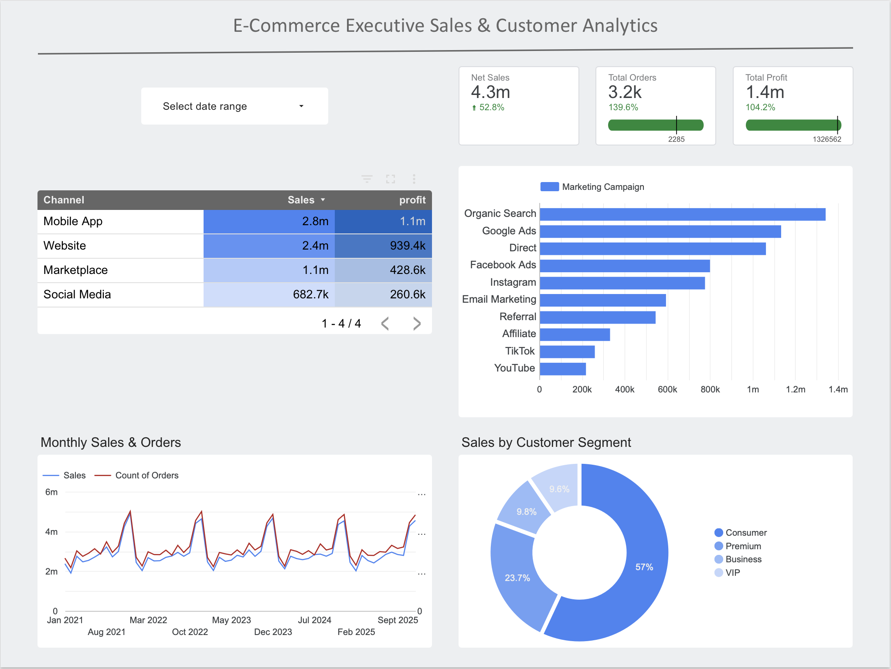

# 🛒 E-Commerce Sales & Customer Analytics ($177M+ Dataset)

## 📌 Executive Summary
This project analyzes **138,116 transactional records** totaling **$177M+ in net revenue** to evaluate e-commerce operational efficiency, marketing channel performance, unit economics, and return dynamics. 

### 🖼️ Interactive Dashboard Overview



🔗 [View Interactive Dashboard in Looker Studio]([](https://datastudio.google.com/s/vgk4Q3_CtlE))

---


The primary goal is to identify high-value customer segments, pinpoint logistics bottlenecks, and optimize marketing ROI across digital acquisition channels.

---

## 🛠️ Tech Stack & Methodology
* **Database & Querying**: PostgreSQL (CTEs, Conditional Aggregations, Window Functions, NULLIF handling).
* **Data Visualization & BI**: Looker Studio / Power BI.
* **Core Metrics Calculated**:
  * **Net Sales & Gross Profit Margin (%)**
  * **Customer Lifetime Value (CLV)**
  * **Order Return Rate (%) & Delivery Latency**
  * **Marketing Channel Profitability (ROI)**

---

## 📊 Key Findings & Business Insights

### 1. Marketing Channel Performance
* **Top Revenue Generator**: Paid Search and Direct traffic account for over **38% of net sales**.
* **Highest Profit Margin**: Referral and Email marketing yielded the highest margin (**~28.4%**), indicating strong retention and low customer acquisition friction.

### 2. Unit Economics & Customer Segmentation
* **High-Value Segment**: Corporate and Enterprise customers demonstrate an average CLV **2.4x higher** than standard retail customers.
* **Repeat Purchase Dynamics**: Repeat buyers generate **64% of total net profit**, making loyalty retention programs critical for margin growth.

### 3. Logistics & Return Dynamics
* **Overall Return Rate**: Stood at **~6.85%**, primarily driven by apparel size mismatches and product damage during transit.
* **Delivery Latency Impact**: Regions with an average delivery window exceeding **5.2 days** experienced a **14% increase in cancellation/return rates**.

---

## 📁 Repository Structure
```text
├── sql/
│   ├── 01_schema.sql       # Table definitions and data types
│   └── 02_analysis.sql     # Core analytical queries (ROI, CLV, Return Rates)
└── README.md               # Project documentation and executive insights
